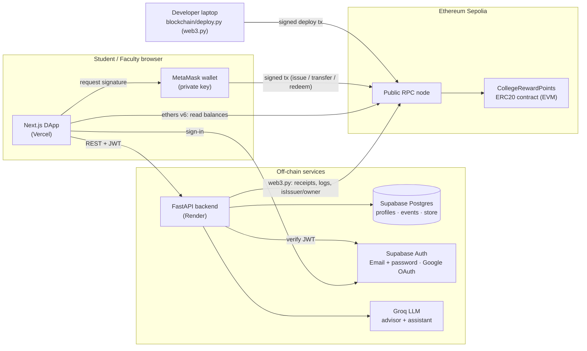

# CampusCoin — College Reward Points (CRP)

> A blockchain-based reward-point system for **Fr. Conceicao Rodrigues College of Engineering (FRCRCE), Bandra**.
> The college issues ERC20 reward points to students for achievements; students hold, transfer and redeem them,
> and every movement is a public, verifiable transaction on the **Ethereum Sepolia** testnet.

Built for **HBCC701 Blockchain Development — ISE-2** (Mini Prototype + Demonstration + Viva).

| | |
|---|---|
| Token | **College Reward Points (CRP)** — ERC20, `decimals = 0` (whole points) |
| Network | Sepolia testnet · chainId `11155111` (`0xaa36a7`) · [sepolia.etherscan.io](https://sepolia.etherscan.io) |
| Contract | [`0xbb92a5633be4937435ce4D5677A25480a23d2b8a`](https://sepolia.etherscan.io/address/0xbb92a5633be4937435ce4D5677A25480a23d2b8a) (deployed with web3.py, block 11874615) |
| Contract | `contracts/CollegeRewardPoints.sol` (Solidity ^0.8.24, no external imports) |
| Toolchain | web3.py + py-solc-x (compile, test on in-memory EVM, deploy, CLI) |
| Backend | FastAPI on Render (free) · Supabase Postgres + Auth · Groq LLM |
| Frontend | Next.js on Vercel (free) · ethers v6 · MetaMask (EIP-6963) · Supabase Google sign-in |
| Report | [`docs/REPORT.md`](docs/REPORT.md) · demo script: [`docs/DEMO_SCRIPT.md`](docs/DEMO_SCRIPT.md) · spec: [`docs/INTERFACES.md`](docs/INTERFACES.md) |

---

## Features

**On-chain (smart contract)**
- Full ERC20: `transfer`, `approve`, `transferFrom`, `allowance`, `balanceOf`, `totalSupply` + `Transfer`/`Approval` events.
- Role-based minting: only the **owner** or an **issuer** (faculty) can `issueReward(to, amount, reason)`; the reason is logged on-chain in a `RewardIssued` event.
- `batchIssueReward` — reward up to 50 students in one transaction (cheaper per student).
- `redeem(amount, itemId)` — students burn points for a store item (canteen voucher, fest pass, hoodie…), emitting `Redeemed`.
- Safety rails: per-transaction issue cap (`maxIssuePerTx`, default 1000), `pause()`/`unpause()` circuit breaker, custom errors, reason length limit, zero-address checks.

**Off-chain (DApp)**
- Google sign-in (Supabase Auth); **wallet linking by signed message** (`personal_sign`) — proves the student owns the address.
- Student dashboard: live balance read **directly from the chain**, send CRP to classmates via a directory, activity feed with Etherscan links, leaderboard, rewards store with voucher codes.
- Issuer console: issue / batch-issue with reward categories; **AI reward advisor** (Groq) suggests category + points + reason from a free-text description.
- Admin console: manage issuers (on-chain `addIssuer`/`removeIssuer`), pause, categories, store items, redemption fulfilment, manual chain sync.
- **AI assistant chat** grounded in the user's own balance, rank, activity, store items and an Ethereum/ERC20 explainer.
- Optional **Sepolia gas drip** — a one-time small ETH top-up so new students can pay gas.
- Event indexer: decodes contract logs into Postgres for fast history and leaderboards; the chain stays the source of truth.

---

## Architecture



**Trust model:** the browser never sends private keys anywhere — MetaMask signs locally. The backend only *observes* the chain
(indexes events, mirrors roles) and cannot mint tokens; minting authority lives exclusively in the contract's issuer list.

---

## Repository structure

```
.
├── contracts/
│   └── CollegeRewardPoints.sol      # ERC20 + roles + issue/batch/redeem + pause
├── blockchain/                      # web3.py toolchain
│   ├── compile.py                   # py-solc-x -> build/CollegeRewardPoints.json (+ backend ABI)
│   ├── test_contract.py             # tests on EthereumTester (in-memory EVM)
│   ├── deploy.py                    # sign + send raw deploy tx to Sepolia
│   ├── interact.py                  # CLI: balance / issue / transfer / redeem / issuers / pause
│   ├── build/                       # ABI + bytecode (committed, public)
│   └── deployments/sepolia.json     # address, block, tx hash (committed, public)
├── backend/                         # FastAPI (Render)
│   ├── app/main.py                  # API entrypoint
│   ├── app/abi/CollegeRewardPoints.json
│   └── requirements.txt
├── frontend/                        # Next.js (Vercel)
├── docs/
│   ├── INTERFACES.md                # shared system spec
│   ├── REPORT.md                    # assignment report (Parts A–D + viva prep)
│   └── DEMO_SCRIPT.md               # timed 5–7 min demo
├── render.yaml                      # Render Blueprint
└── README.md
```

---

## Local setup

**Prerequisites:** Python 3.11, Node.js 20+, Git, MetaMask (browser extension), a Supabase project, and some Sepolia ETH for the
deployer account (free faucets: Google Cloud Web3 faucet, Alchemy, Infura, PoW faucet).

### 1. Blockchain — compile, test, deploy

```bash
# from the repo root (a shared venv lives at ./.venv)
python -m venv .venv
# Windows:  .venv\Scripts\activate      macOS/Linux:  source .venv/bin/activate
pip install -r blockchain/requirements.txt

cd blockchain
cp .env.example .env          # fill SEPOLIA_RPC_URL, CHAIN_ID=11155111, DEPLOYER_PRIVATE_KEY
python compile.py             # downloads solc, writes build/ + backend/app/abi/
python test_contract.py       # runs the full suite on an in-memory EVM (no ETH needed)
python deploy.py              # deploys to Sepolia, writes deployments/sepolia.json
python interact.py --help     # e.g. issue / transfer / balance / redeem from the terminal
```

> Use a **fresh, test-only** MetaMask account for `DEPLOYER_PRIVATE_KEY`. Never reuse a key that holds real funds.

### 2. Backend — FastAPI

```bash
cd backend
pip install -r requirements.txt       # same .venv is fine
cp .env.example .env                  # see "Environment variables" below
# apply the database schema + seed data (6 reward categories, 6 store items)
#   -> python migrate.py        (idempotent: creates tables, enables RLS, seeds catalog)
uvicorn app.main:app --reload --port 8000
# check: http://localhost:8000/api/health  and  http://localhost:8000/docs
```

### 3. Frontend — Next.js

```bash
cd frontend
npm install
cp .env.example .env.local            # values below
npm run dev                           # http://localhost:3000
```

### Environment variables

| Where | Variable | Notes |
|---|---|---|
| backend | `DATABASE_URL` | Supabase → Project Settings → Database → Connection string → **Pooler** (secret) |
| backend | `SUPABASE_URL` | `https://pzcimxioslwojjjotrde.supabase.co` |
| backend | `SUPABASE_ANON_KEY` | Supabase → Project Settings → API → `anon` `public` key |
| backend | `SUPABASE_JWT_SECRET` | Supabase → Project Settings → API → JWT Settings (secret) |
| backend | `SUPABASE_SERVICE_ROLE_KEY` | Supabase → Project Settings → API (service_role, **server-only**). Enables instant email/password sign-up without confirmation emails; if unset, sign-up falls back to Supabase confirmation emails |
| backend | `FRONTEND_ORIGINS` | comma list, e.g. `http://localhost:3000,https://<app>.vercel.app` |
| backend | `ADMIN_EMAILS` | comma list of Google accounts that get admin |
| backend | `SEPOLIA_RPC_URL`, `CHAIN_ID` | `https://ethereum-sepolia-rpc.publicnode.com`, `11155111` |
| backend | `CONTRACT_ADDRESS`, `CONTRACT_DEPLOY_BLOCK` | from `blockchain/deployments/sepolia.json` |
| backend | `GAS_DRIP_PRIVATE_KEY`, `GAS_DRIP_AMOUNT_ETH`, `GAS_DRIP_MIN_BALANCE_ETH` | optional faucet wallet; leave key empty to disable |
| backend | `GROQ_API_KEY`, `GROQ_MODEL` | free key at console.groq.com |
| frontend | `NEXT_PUBLIC_SUPABASE_URL`, `NEXT_PUBLIC_SUPABASE_ANON_KEY` | same project as backend |
| frontend | `NEXT_PUBLIC_API_URL` | `http://localhost:8000` locally, Render URL in prod |
| frontend | `NEXT_PUBLIC_CONTRACT_ADDRESS`, `NEXT_PUBLIC_CHAIN_ID`, `NEXT_PUBLIC_SEPOLIA_RPC_URL` | contract address, `11155111`, public RPC |
| blockchain | `SEPOLIA_RPC_URL`, `CHAIN_ID`, `DEPLOYER_PRIVATE_KEY` | deployer key is secret |

The `anon` key is designed to be public (it ships in the browser). All tables have **RLS enabled with no policies**, so the
anon key cannot read them; only the backend's `postgres` role can.

---

## Production deployment

### (a) Supabase — Google sign-in

1. **Google Cloud Console** → APIs & Services → *OAuth consent screen* (External, add your test users) → *Credentials* →
   **Create OAuth client ID** → type *Web application*.
   - **Authorized redirect URI:** `https://pzcimxioslwojjjotrde.supabase.co/auth/v1/callback`
   - Copy the **Client ID** and **Client secret**.
2. **Supabase** → Authentication → **Sign In / Providers** → *Google* → enable, paste Client ID + secret → Save.
3. **Supabase** → Authentication → **URL Configuration**
   - **Site URL:** `https://<app>.vercel.app`
   - **Redirect URLs:** `http://localhost:3000/**` and `https://<app>.vercel.app/**`
4. **Keys:** Project Settings → **API** → *Project URL* and the `anon` `public` key (frontend + backend). The JWT secret is under
   *JWT Settings* (backend only). The pooler `DATABASE_URL` is under Project Settings → **Database** (backend only).

### (b) Deploy the contract (web3.py)

```bash
cd blockchain
python compile.py && python test_contract.py && python deploy.py
```

`deploy.py` builds the constructor transaction, signs it locally with `DEPLOYER_PRIVATE_KEY`, sends it with
`eth_sendRawTransaction`, waits for the receipt and writes `deployments/sepolia.json` (`address`, `deployBlock`, `txHash`).
Open `https://sepolia.etherscan.io/address/<address>` to confirm. Commit `build/` and `deployments/`.

### (c) Backend on Render (Blueprint)

1. Push the repo to GitHub.
2. Render Dashboard → **New → Blueprint** → select the repo. Render reads [`render.yaml`](render.yaml)
   (free plan, Singapore, root `backend`, health check `/api/health`).
3. Fill every variable marked `sync: false` (`DATABASE_URL`, `SUPABASE_ANON_KEY`, `SUPABASE_JWT_SECRET`, `SUPABASE_SERVICE_ROLE_KEY`, `FRONTEND_ORIGINS`,
   `ADMIN_EMAILS`, `CONTRACT_ADDRESS`, `CONTRACT_DEPLOY_BLOCK`, `GAS_DRIP_PRIVATE_KEY`, `GROQ_API_KEY`). For now set
   `FRONTEND_ORIGINS=http://localhost:3000`; you will update it after step (d).
4. Deploy, then open `https://<service>.onrender.com/api/health` → `{"status":"ok","db":true,"chain":true,...}`.

> **Free-tier cold starts:** Render free web services sleep after ~15 min idle and take ~50 s to wake. Before a demo, open
> `/api/health` once. Optionally keep it warm with a free uptime pinger (UptimeRobot, cron-job.org, Better Stack) hitting
> `https://<service>.onrender.com/api/health` every **10 minutes**.

### (d) Frontend on Vercel

1. Vercel → **Add New Project** → import the repo → **Root Directory: `frontend`** (framework auto-detected: Next.js).
2. Environment variables: `NEXT_PUBLIC_SUPABASE_URL`, `NEXT_PUBLIC_SUPABASE_ANON_KEY`,
   `NEXT_PUBLIC_API_URL=https://<service>.onrender.com`, `NEXT_PUBLIC_CONTRACT_ADDRESS`, `NEXT_PUBLIC_CHAIN_ID=11155111`,
   `NEXT_PUBLIC_SEPOLIA_RPC_URL=https://ethereum-sepolia-rpc.publicnode.com`.
3. Deploy → note the URL `https://<app>.vercel.app`.
4. Back on **Render**, set `FRONTEND_ORIGINS=https://<app>.vercel.app,http://localhost:3000` (no trailing slash) and redeploy.
5. Back on **Supabase**, make sure Site URL / Redirect URLs use this exact Vercel URL (step a.3).

---

## Demo script (5–7 min viva) — quick version

Full timed script: [`docs/DEMO_SCRIPT.md`](docs/DEMO_SCRIPT.md).

0. **Prep (before the viva):** wake Render (`/api/health`); two MetaMask accounts on Sepolia — *Faculty* (owner/issuer) and
   *Student*, both with a little Sepolia ETH; both wallets linked to Google accounts; Etherscan tab open on the contract.
1. **Problem & architecture (1 min)** — show the architecture diagram and the Ethereum component mapping.
2. **Issue** — as Faculty, Issuer console → describe "won 1st place at the college hackathon" → AI advisor suggests
   *Hackathon Win, 200 CRP* → **Issue** → MetaMask confirm → tx hash appears.
3. **Show the transaction** — open it on Etherscan: `from` = faculty, `to` = contract, *Logs* show `Transfer(0x0 → student, 200)`
   and `RewardIssued(..., "Hackathon Win ...")`, gas used, block number.
4. **Check balance** — Student dashboard balance = 200 (read straight from the chain); optionally `python interact.py balance <addr>`.
5. **Transfer** — Student sends 30 CRP to a classmate → confirm → both balances update; `Transfer` event on Etherscan.
6. **Redeem** — Student redeems *Canteen Meal Voucher (50)* → tokens burned (`Transfer → 0x0`, `Redeemed`) → voucher code shown;
   `totalSupply` drops by 50.
7. **Security moment** — try to issue from the Student wallet → transaction reverts with `NotIssuer()`; show `pause()` blocks transfers.
8. **Code walkthrough** — `onlyIssuer`, `issueReward`, `_transfer`, `redeem` in `CollegeRewardPoints.sol`.

---

## Troubleshooting

| Symptom | Cause / fix |
|---|---|
| "Wrong network" banner / balances show 0 | MetaMask is not on Sepolia. Click **Switch network** in the app (it calls `wallet_switchEthereumChain` → `0xaa36a7`, adding the chain if missing). Enable *Show test networks* in MetaMask. |
| `insufficient funds for gas` | The wallet has no Sepolia ETH. Use the in-app **gas drip** (if enabled) or a public Sepolia faucet. Tokens ≠ gas: you need ETH even to move CRP. |
| Transaction reverts `NotIssuer()` | The connected wallet is not owner/issuer. Owner must call `addIssuer(wallet)` (Admin console). |
| Reverts `ExceedsMaxIssue` / `BatchTooLarge` / `ReasonTooLong` | Amount > `maxIssuePerTx` (1000), > 50 recipients, or reason > 96 bytes. |
| Reverts `ContractPaused()` | Admin paused the contract — `unpause()`. |
| Browser console: **CORS** error calling the API | `FRONTEND_ORIGINS` on Render must contain the exact origin (scheme + host, no trailing slash), then redeploy. Also confirm `NEXT_PUBLIC_API_URL` has no trailing slash. |
| Google login: `redirect_uri_mismatch` | The Google OAuth client must list **only** `https://pzcimxioslwojjjotrde.supabase.co/auth/v1/callback` as redirect URI. |
| Login returns to `localhost` in production / "redirect not allowed" | Supabase → URL Configuration: Site URL = Vercel URL; Redirect URLs include `https://<app>.vercel.app/**`. |
| First API call takes ~50 s or times out | Render free cold start. Hit `/api/health` and wait; set up the 10-minute uptime pinger. |
| Activity feed missing a transaction | The indexer syncs on a throttle; the app also posts every tx to `/api/tx/record`. Admin → **Sync chain** forces a re-index. Balances are always read from chain. |
| Wallet link fails "signature expired" | The link message is valid for 10 minutes — request a fresh one. "Already linked" (409) means the address belongs to another profile. |
| MetaMask not detected / wrong wallet pops up | The app discovers wallets via EIP-6963; disable conflicting wallet extensions or pick MetaMask in the selector. |

---

## Security notes

- No secrets in git: `.env*` files are ignored; Render/Vercel hold secrets as environment variables.
- Only on-chain issuers can mint; the database role only gates UI. Even a fully compromised backend cannot create CRP.
- Private keys stay in MetaMask; the backend only verifies signatures (`personal_sign`) to link wallets.

## License

Academic project — FRCRCE, HBCC701 ISE-2, 2026–27.
