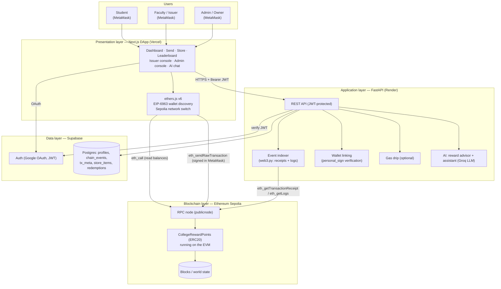
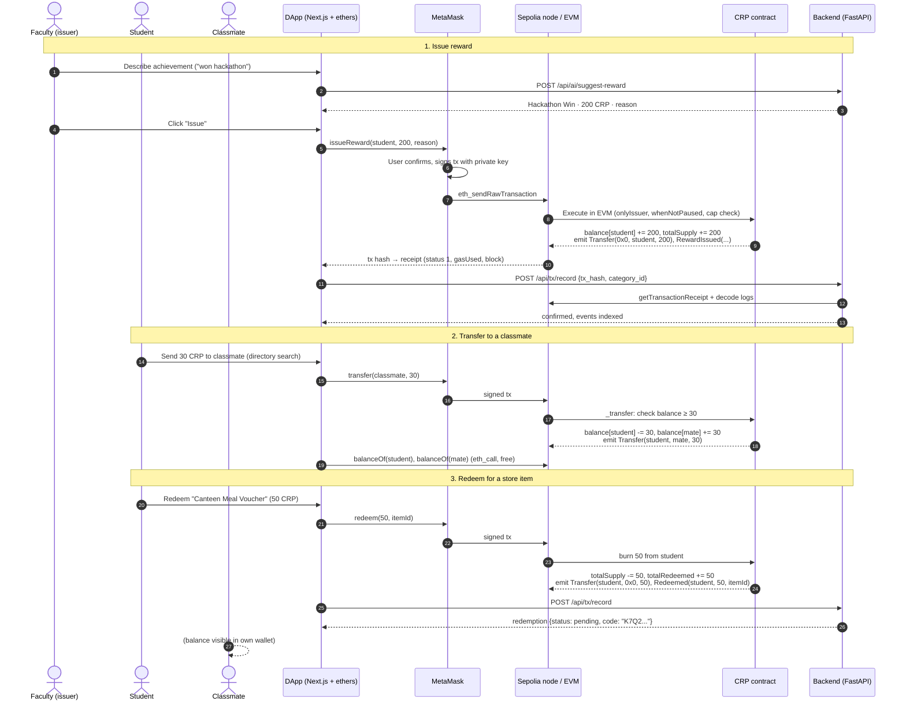

# CampusCoin — A Blockchain-Based College Reward Point System

**Course:** Blockchain Development (HBCC701) — ISE-2 · Mini Prototype + Demonstration + Viva
**Institute:** Fr. Conceicao Rodrigues College of Engineering (FRCRCE), Bandra (W), Mumbai
**Academic Year / Semester:** 2026–27 · Semester VII (Odd)

| Student Name | Roll No. | Class / Division | Date of Submission |
|---|---|---|---|
| `<Student Name>` | `<Roll No.>` | `<Class>` | `<DD/MM/2026>` |

**Prototype links**

| Item | Value |
|---|---|
| Source code repository | `<GitHub URL>` |
| Live DApp (Vercel) | `https://<app>.vercel.app` |
| Backend API (Render) | `https://<service>.onrender.com/api/health` |
| Contract address (Sepolia) | `0xbb92a5633be4937435ce4D5677A25480a23d2b8a` — https://sepolia.etherscan.io/address/0xbb92a5633be4937435ce4D5677A25480a23d2b8a |
| Deployment transaction | `0xffff6d273e0862e920f154d2ec93887668e2a87b1e4052db20341905c9d081a2` (block `11874615`, deployed with web3.py) |

---

## Table of Contents

1. [Part A — Problem, Objective, Blockchain Justification and Architecture](#part-a--problem-objective-blockchain-justification-and-architecture)
2. [Part B — Source Code / Prototype with Evidence of Execution](#part-b--source-code--prototype-with-evidence-of-execution)
3. [Part C — Technology Research and Selection](#part-c--technology-research-and-selection)
4. [Part D — Security, Limitations and Research Challenge](#part-d--security-limitations-and-research-challenge)
5. [Conclusion](#conclusion)
6. [Viva Preparation — 15 Likely Questions](#viva-preparation--15-likely-questions)
7. [References](#references)

---

## Part A — Problem, Objective, Blockchain Justification and Architecture

### A.1 Problem Statement

Colleges reward students for hackathon wins, paper publications, volunteering, sports, attendance and club leadership. Today these rewards are tracked in spreadsheets, certificates or department-specific portals. This creates four problems:

1. **No single, trusted ledger.** Each department keeps its own records; totals cannot be verified by students or auditors.
2. **Records can be altered silently.** A spreadsheet row can be edited or deleted without trace — there is no audit trail.
3. **Points are not portable.** Students cannot gift points to teammates, and points earned in one department cannot be spent elsewhere (canteen, library, store).
4. **Opaque issuance.** Students cannot see *who* awarded points, *when*, and *why*, and there is no limit on how many points an individual can create.

### A.2 Objective

Design and implement a small, executable **ERC20-based reward-point token** — *College Reward Points (CRP)* — through which:

- authorised college staff (**issuers**) can **issue** points to students with an on-chain reason;
- students can **check their balance** and **transfer** points to other students;
- students can **redeem** (burn) points for items in a college rewards store;
- every action is a **verifiable transaction** on a public Ethereum network (Sepolia testnet), visible on Etherscan;
- a user-friendly **DApp** (web app + MetaMask) hides blockchain complexity from students.

### A.3 Why Blockchain Is Relevant

| Requirement | How blockchain satisfies it |
|---|---|
| Tamper-evident history | Every issue/transfer/redeem is a signed transaction in a hash-linked block; it cannot be edited after confirmation. |
| Transparency & auditability | Anyone can verify `totalSupply`, every balance and every `RewardIssued(issuer, to, amount, reason)` event on Etherscan. |
| Rules enforced by code | The smart contract — not an administrator — enforces "only issuers can mint", "max 1000 per transaction", "cannot spend more than you have". |
| True ownership & portability | Points live in the student's own wallet; they can transfer them peer-to-peer without asking the college. |
| Interoperability | ERC20 is a universal standard: any wallet (MetaMask), explorer or exchange-style tool understands CRP immediately. |
| No single point of failure | The ledger is replicated across thousands of Ethereum nodes; the college server going down does not erase balances. |

**When blockchain is *not* the right choice (honest assessment).** A single college that fully trusts its own IT department could implement points with an ordinary database more cheaply and faster. Blockchain adds value here mainly because (a) students and auditors should be able to verify issuance *without trusting* the administration, (b) points should be student-owned and transferable, and (c) multiple departments/colleges could share one ledger in future. Blockchain is a poor fit for storing private data (marks, Aadhaar, phone numbers), for high-frequency micro-events (every attendance tap), or where the legal owner must be able to reverse any record at will. In CampusCoin, private data stays off-chain in Postgres; only pseudonymous addresses and point movements are on-chain.

### A.4 System Architecture



**Layer responsibilities**

- **Blockchain layer** — source of truth for balances, total supply, roles (owner/issuers) and the pause flag.
- **Application layer** — convenience only: indexes events into Postgres for fast history/leaderboards, maps wallets to names, manages the store catalogue and voucher codes, runs the AI features. It **cannot mint or move tokens**.
- **Presentation layer** — reads balances directly from the chain via a public RPC (so the UI is correct even if the backend is down) and asks MetaMask to sign every state-changing transaction.

### A.5 Workflow — Issue → Transfer → Redeem



### A.6 Mapping of Ethereum Components

| Ethereum component | What it is | Role in CampusCoin |
|---|---|---|
| **Account** | *Externally Owned Account* (EOA) controlled by a private key, or a *contract account* controlled by code. Identified by a 20-byte address. | Each student, faculty issuer and the admin has an EOA in MetaMask. The CRP smart contract itself is a contract account holding the `balanceOf` mapping. The deployer EOA becomes `owner` and first issuer. |
| **Transaction** | A signed message from an EOA that changes state (value transfer, contract creation or contract call). Contains nonce, to, data, gas limit, fee fields, signature. | Contract deployment (via web3.py), `issueReward`, `batchIssueReward`, `transfer`, `approve`, `redeem`, `addIssuer`, `pause` — each is one transaction, visible on Etherscan with its hash. Reads (`balanceOf`) are *calls*, not transactions, and are free. |
| **Ether (ETH)** | Native currency of Ethereum, used to pay for gas. | Sepolia test-ETH pays gas for every CRP transaction. **CRP ≠ ETH**: CRP is a token recorded inside the contract; ETH is the native asset needed to submit transactions. The optional gas drip gives new students a small amount of test ETH. |
| **Gas** | Unit measuring computational work; fee = gasUsed × (base fee + priority tip) (EIP-1559). Prevents infinite loops and spam. | Each operation has a gas cost (storage writes dominate). `batchIssueReward` amortises the fixed 21,000-gas transaction cost over up to 50 students; the 50-recipient cap keeps each batch well under the block gas limit. Reverted transactions still consume gas. |
| **EVM** | Ethereum Virtual Machine — a deterministic, sandboxed stack machine that executes contract bytecode identically on every node. | Executes the compiled `CollegeRewardPoints` bytecode: checks modifiers (`onlyIssuer`, `whenNotPaused`), updates balances with Solidity 0.8 checked arithmetic, emits logs, reverts with custom errors. Locally the same bytecode runs on **EthereumTester** (an in-memory EVM) for unit tests. |
| **Node** | A computer running Ethereum client software (e.g. Geth + a consensus client) that stores state, validates blocks and serves JSON-RPC. | The DApp and backend talk to a public Sepolia RPC node (`ethereum-sepolia-rpc.publicnode.com`): `eth_call` for reads, `eth_sendRawTransaction` to broadcast, `eth_getTransactionReceipt` / `eth_getLogs` for indexing. Validators include the transactions in blocks. |
| **Blockchain** | Append-only chain of blocks, each containing transactions and linked by hashes, agreed via Proof-of-Stake consensus. | Permanent, public record of every reward issued, transferred and redeemed. Block number and timestamp give each reward an immutable date; `chain_events` in Postgres is just a cache of this record and can always be rebuilt from the chain. |

Additional components used: **Wallet** (MetaMask — key storage and signing), **Smart contract** (business rules), **Events/Logs** (cheap, indexable history), **Testnet** (Sepolia — real network conditions without real money), **Block explorer** (Etherscan — independent verification).

---

## Part B — Source Code / Prototype with Evidence of Execution

### B.1 Components Implemented

| Path | Purpose |
|---|---|
| `contracts/CollegeRewardPoints.sol` | Application-specific ERC20 contract (Solidity ^0.8.24, self-contained, no imports). |
| `blockchain/compile.py` | Compiles with **py-solc-x**; writes ABI + bytecode to `blockchain/build/` and the ABI to the backend. |
| `blockchain/test_contract.py` | Automated tests on **EthereumTester** (in-memory EVM via web3.py). |
| `blockchain/deploy.py` | Signs and broadcasts the deployment transaction to Sepolia with **web3.py**. |
| `blockchain/interact.py` | Command-line client: balance, issue, batch-issue, transfer, redeem, add/remove issuer, pause. |
| `backend/` | FastAPI service: auth, wallet linking, event indexing, store/redemptions, AI. |
| `frontend/` | Next.js DApp with ethers v6 + MetaMask. |

### B.2 Smart Contract Walkthrough — `CollegeRewardPoints`

**Token metadata:** `name = "College Reward Points"`, `symbol = "CRP"`, `decimals = 0`, initial supply **0** (points exist only once issued). The deployer becomes `owner` and is implicitly an issuer.

#### State variables

| Variable | Type | Meaning |
|---|---|---|
| `name`, `symbol`, `decimals` | `string`, `string`, `uint8` | ERC20 metadata (`decimals = 0`). |
| `totalSupply` | `uint256` | Points currently in circulation (issued − redeemed). |
| `balanceOf` | `mapping(address => uint256)` | Points held by each account. |
| `allowance` | `mapping(address => mapping(address => uint256))` | How many points a spender may move on an owner's behalf. |
| `owner` | `address` | Administrator (college) — manages issuers, cap and pause. |
| `isIssuer` (backed by a mapping) | `address => bool` | Faculty allowed to mint; returns `true` for the owner as well. |
| `paused` | `bool` | Circuit-breaker flag. |
| `maxIssuePerTx` | `uint256` | Per-recipient cap per issue call (default **1000**). |
| `totalIssued`, `totalRedeemed` | `uint256` | Lifetime statistics (`totalSupply = totalIssued − totalRedeemed`). |
| Constants | — | `MAX_BATCH = 50` recipients, `MAX_REASON_LENGTH = 96` bytes. |

#### Modifiers

| Modifier | Check | Error |
|---|---|---|
| `onlyOwner` | `msg.sender == owner` | `NotOwner()` |
| `onlyIssuer` | `isIssuer(msg.sender)` (owner or added issuer) | `NotIssuer()` |
| `whenNotPaused` | `!paused` | `ContractPaused()` |

#### Functions

| Function | Access | Behaviour | Events |
|---|---|---|---|
| `transfer(to, amount)` | any holder, not paused | Moves points from caller to `to`; reverts on zero address or insufficient balance; returns `true`. | `Transfer` |
| `approve(spender, amount)` | any holder | Sets `allowance[caller][spender] = amount`. | `Approval` |
| `transferFrom(from, to, amount)` | approved spender, not paused | Decreases allowance, then moves points `from → to`. | `Transfer` (+ allowance update) |
| `issueReward(to, amount, reason)` | `onlyIssuer`, not paused | Validates `to ≠ 0x0`, `amount > 0`, `amount ≤ maxIssuePerTx`, `bytes(reason).length ≤ 96`; mints: `balanceOf[to] += amount`, `totalSupply += amount`, `totalIssued += amount`. | `Transfer(0x0, to, amount)`, `RewardIssued(issuer, to, amount, reason)` |
| `batchIssueReward(recipients[], amounts[], reason)` | `onlyIssuer`, not paused | Same checks per recipient; arrays must be equal length (`LengthMismatch`) and ≤ 50 (`BatchTooLarge`). One transaction rewards a whole team/class. | one `Transfer` + `RewardIssued` per recipient |
| `redeem(amount, itemId)` | any holder, not paused | Burns caller's points (`balance −= amount`, `totalSupply −= amount`, `totalRedeemed += amount`) for store item `itemId`. | `Transfer(from, 0x0, amount)`, `Redeemed(student, amount, itemId)` |
| `addIssuer(account)` / `removeIssuer(account)` | `onlyOwner` | Grants / revokes minting rights (faculty onboarding/offboarding). The owner always remains an issuer. | `IssuerAdded` / `IssuerRemoved` |
| `transferOwnership(newOwner)` | `onlyOwner` | Hands admin control to a new address (non-zero); new owner is implicitly an issuer. | `OwnershipTransferred` |
| `setMaxIssuePerTx(newMax)` | `onlyOwner` | Adjusts the issuance cap. | `MaxIssuePerTxUpdated` |
| `pause()` / `unpause()` | `onlyOwner` | Freezes / resumes transfers, issuance and redemption in an emergency. | `Paused` / `Unpaused` |
| Views | public | `name, symbol, decimals, totalSupply, balanceOf, allowance, owner, isIssuer, paused, maxIssuePerTx, totalIssued, totalRedeemed` — free `eth_call`s. | — |

#### Custom errors

`NotOwner()`, `NotIssuer()`, `ContractPaused()`, `ZeroAddress()`, `ZeroAmount()`, `InsufficientBalance(available, required)`, `InsufficientAllowance(available, required)`, `ExceedsMaxIssue(amount, max)`, `LengthMismatch()`, `BatchTooLarge(size, max)`, `ReasonTooLong()`.

Custom errors (Solidity ≥ 0.8.4) are cheaper than `require("long string")` because only a 4-byte selector plus arguments is stored in the bytecode and returned, and they carry structured data (e.g. how much balance was available) that the DApp decodes into a friendly message.

#### Why `decimals = 0`?

`decimals` is display metadata only: the contract always stores integers. Reward points are naturally **whole numbers** — nobody earns 0.37 of a point. With `decimals = 0`, the on-chain integer *is* the number shown to users (`200` means 200 CRP, not `200 × 10¹⁸` base units). This removes a common class of UI/rounding bugs, keeps calldata small, and makes Etherscan, MetaMask and the CLI all show the same human-readable value. (Most currency-like ERC20s use 18 to mimic ETH divisibility, which CRP does not need.)

#### Key code excerpts

> Paste the final code from `contracts/CollegeRewardPoints.sol` here when exporting to PDF. Recommended excerpts: the modifiers, `_transfer`, `_mint` / `issueReward`, `batchIssueReward`, and `redeem`.

```solidity
// [Excerpt: modifiers onlyIssuer / whenNotPaused]

// [Excerpt: issueReward(address to, uint256 amount, string calldata reason)]

// [Excerpt: _transfer(address from, address to, uint256 amount)]

// [Excerpt: redeem(uint256 amount, uint256 itemId)]
```

### B.3 Execution Environment — Justification

The brief suggests Remix/Ganache/MetaMask "or another justified environment". This prototype uses:

- **web3.py + py-solc-x** for compile/test/deploy — a scriptable, reproducible pipeline (the same command produces the same artifact every time), which is easier to show and explain than clicking through Remix. Remix can still be used to view the same source and call the deployed contract via *At Address*.
- **EthereumTester (py-evm)** as a local in-memory blockchain — functionally the same role as **Ganache**: instant blocks, pre-funded accounts, no real ETH, reset on every run.
- **Sepolia testnet + MetaMask** for the live demo — a real public Ethereum network with real consensus, real gas and an independent explorer (Etherscan), so evidence of execution can be verified by the examiner.

### B.4 Deployment via web3.py


Steps performed by `blockchain/deploy.py`:

1. **Compile** — `compile.py` installs a pinned `solc` version via py-solc-x and compiles with the optimizer; outputs `{contractName, abi, bytecode, compiler}`.
2. **Connect** — `Web3(HTTPProvider(SEPOLIA_RPC_URL))`, verify `chain_id == 11155111`, check the deployer's ETH balance.
3. **Build** — `w3.eth.contract(abi=..., bytecode=...).constructor().build_transaction({...})` with the account nonce and EIP-1559 fee fields; gas estimated via `eth_estimateGas`.
4. **Sign locally** — `w3.eth.account.sign_transaction(tx, private_key)`; the private key never leaves the machine.
5. **Send** — `w3.eth.send_raw_transaction(signed.raw_transaction)` returns the transaction hash.
6. **Wait for receipt** — `w3.eth.wait_for_transaction_receipt(hash)` gives `contractAddress`, `blockNumber`, `gasUsed`, `status`.
7. **Persist** — writes `deployments/sepolia.json` (`address`, `deployBlock`, `txHash`, `deployer`, `deployedAt`) consumed by the backend (`CONTRACT_ADDRESS`, `CONTRACT_DEPLOY_BLOCK`) and frontend (`NEXT_PUBLIC_CONTRACT_ADDRESS`).

### B.5 Evidence of Execution

> Replace each placeholder with a screenshot when exporting the PDF. All hashes are verifiable at `https://sepolia.etherscan.io/tx/<hash>`.

**[Screenshot 1: `python test_contract.py` — all tests passing]**

**[Screenshot 2: `python deploy.py` terminal output — tx hash, contract address, gas used]**

**[Screenshot 3: Deployment transaction on Etherscan (Contract Creation)]**

**[Screenshot 4: DApp — Issuer console with AI suggestion and MetaMask confirmation popup]**

**[Screenshot 5: `issueReward` transaction on Etherscan — *Logs* tab showing `Transfer(0x0 → student)` and `RewardIssued`]**

**[Screenshot 6: Student dashboard — balance before and after]**

**[Screenshot 7: `transfer` transaction on Etherscan + both balances updated]**

**[Screenshot 8: `redeem` transaction — `Transfer(student → 0x0)` + `Redeemed`, voucher code in the DApp]**

**[Screenshot 9: Reverted transaction — student wallet calling `issueReward` fails with `NotIssuer()`]**

**[Screenshot 10: `python interact.py balance <address>` output matching the DApp]**

#### Transaction log

| # | Action | From | To / Args | Tx hash | Block | Gas used | Result |
|---|---|---|---|---|---|---|---|
| 1 | Deploy contract | Deployer `<0x..>` | — | `<0x..>` | `<n>` | `<gas>` | Contract `<0x..>` |
| 2 | `addIssuer` | Owner | Faculty `<0x..>` | `<0x..>` | `<n>` | `<gas>` | `IssuerAdded` |
| 3 | `issueReward` | Faculty | Student A, 200, "Hackathon Win" | `<0x..>` | `<n>` | `<gas>` | Student A = 200 |
| 4 | `batchIssueReward` | Faculty | [A, B, C], [50, 50, 50], "Event Volunteering" | `<0x..>` | `<n>` | `<gas>` | +50 each |
| 5 | `transfer` | Student A | Student B, 30 | `<0x..>` | `<n>` | `<gas>` | A = 220, B = 80 |
| 6 | `redeem` | Student A | 50, itemId 1 (Canteen Meal Voucher) | `<0x..>` | `<n>` | `<gas>` | A = 170, supply −50 |
| 7 | `issueReward` (negative test) | Student B | — | `<0x..>` | `<n>` | `<gas>` | Reverted: `NotIssuer()` |

#### State before and after

| Quantity | Before | After issue (3) | After batch (4) | After transfer (5) | After redeem (6) |
|---|---|---|---|---|---|
| `balanceOf(A)` | 0 | 200 | 250 | 220 | 170 |
| `balanceOf(B)` | 0 | 0 | 50 | 80 | 80 |
| `balanceOf(C)` | 0 | 0 | 50 | 50 | 50 |
| `totalSupply` | 0 | 200 | 350 | 350 | 300 |
| `totalIssued` | 0 | 200 | 350 | 350 | 350 |
| `totalRedeemed` | 0 | 0 | 0 | 0 | 50 |

Note how a transfer changes balances but **not** `totalSupply`, while redeem (burn) reduces `totalSupply` and a mint increases it.

### B.6 Demonstration Sequence (as performed live)

1. **Allocate** — faculty issues 200 CRP to Student A (`issueReward`), MetaMask signs, tx confirmed in ~12 s.
2. **Show transaction** — Etherscan page: status *Success*, block, gas used, input data decoded as `issueReward(...)`, logs.
3. **Check balance** — DApp reads `balanceOf(A)` directly from the node → 200; CLI confirms.
4. **Transfer** — A sends 30 CRP to B (`transfer`) → both balances update.
5. **Redeem** — A redeems 50 CRP for a canteen voucher → `totalSupply` falls by 50; voucher code issued by backend.
6. **Security** — B tries to mint → reverts with `NotIssuer()`; owner pauses → transfers revert with `ContractPaused()`.

### B.7 Test Results — `blockchain/test_contract.py`

Tests run on **EthereumTester**, an in-memory EVM bundled with web3.py: each test deploys a fresh contract from pre-funded test accounts, so no ETH or network is needed and results are deterministic.

| # | Test case | Expected result | Status |
|---|---|---|---|
| 1 | Deployment metadata | name "College Reward Points", symbol "CRP", decimals 0, totalSupply 0, owner = deployer, deployer is issuer, maxIssuePerTx 1000 | PASS |
| 2 | Owner issues reward | balance and totalSupply/totalIssued increase; `Transfer(0x0,to,amt)` and `RewardIssued` emitted with reason | PASS |
| 3 | Non-issuer cannot issue | reverts `NotIssuer()` | PASS |
| 4 | Add / remove issuer | `IssuerAdded` / `IssuerRemoved`; added faculty can issue, removed cannot; only owner may call (`NotOwner()`) | PASS |
| 5 | Issue validation | zero amount → `ZeroAmount()`; zero address → `ZeroAddress()`; amount > cap → `ExceedsMaxIssue`; reason > 96 bytes → `ReasonTooLong()` | PASS |
| 6 | `setMaxIssuePerTx` | owner updates cap, event emitted; new cap enforced | PASS |
| 7 | Batch issue | all recipients credited, one `RewardIssued` each; `LengthMismatch()` for unequal arrays; `BatchTooLarge` above 50 | PASS |
| 8 | Transfer | balances move, totalSupply unchanged, `Transfer` emitted; overspend → `InsufficientBalance(available, required)`; to 0x0 → `ZeroAddress()` | PASS |
| 9 | Approve / transferFrom / allowance | allowance set, spent and decremented; over-allowance → `InsufficientAllowance` | PASS |
| 10 | Redeem | balance and totalSupply decrease, totalRedeemed increases; `Transfer(from,0x0)` + `Redeemed(student,amt,itemId)`; overspend reverts | PASS |
| 11 | Pause / unpause | only owner; while paused transfer/transferFrom/issue/redeem revert `ContractPaused()`; resume after unpause | PASS |
| 12 | Ownership transfer | `OwnershipTransferred`; old owner loses admin rights, new owner can add issuers and issue | PASS |
| 13 | Supply invariant | `totalSupply == totalIssued − totalRedeemed == Σ balances` after a mixed sequence | PASS |

**[Screenshot: test run output — `<N> passed`]**

### B.8 How a Transaction Is Processed (what changed and why)

1. The DApp encodes the call (`issueReward(to, 200, "Hackathon Win")`) using the ABI → 4-byte selector + ABI-encoded arguments.
2. MetaMask shows the gas estimate; the user approves; MetaMask signs with the private key (ECDSA secp256k1) → raw transaction.
3. The node validates the signature, nonce and balance for fees, and gossips it to the mempool.
4. A validator includes it in a block. Every node executes it in the EVM: modifiers run first (`onlyIssuer`, `whenNotPaused`), then storage slots for `balanceOf[to]`, `totalSupply`, `totalIssued` are updated, and logs are emitted.
5. The receipt records `status = 1`, `gasUsed`, `effectiveGasPrice` and the logs. Fee paid = `gasUsed × effectiveGasPrice` in ETH.
6. If any check fails, the EVM **reverts** all state changes for that transaction (atomicity), but gas consumed so far is still paid.

---

## Part C — Technology Research and Selection

### C.1 ERC20 Token Standard (EIP-20)

ERC20 defines a common interface so that any wallet or DApp can interact with any fungible token. CRP implements all of it.

| Function / event | Signature | Purpose | Notes in CRP |
|---|---|---|---|
| `totalSupply` | `totalSupply() → uint256` | Total tokens in existence | Grows on issue, shrinks on redeem. |
| `balanceOf` | `balanceOf(address) → uint256` | Tokens held by an address | Read directly from chain by the DApp (free `eth_call`). |
| `transfer` | `transfer(to, amount) → bool` | Caller sends tokens | Student-to-student gifting; blocked when paused. |
| `approve` | `approve(spender, amount) → bool` | Authorise a spender | E.g. allow a future store contract to pull points. |
| `allowance` | `allowance(owner, spender) → uint256` | Remaining approved amount | Decremented by `transferFrom`. |
| `transferFrom` | `transferFrom(from, to, amount) → bool` | Spender moves tokens on owner's behalf | Enables "pull" payments by contracts. |
| `Transfer` event | `Transfer(from indexed, to indexed, value)` | Log of every movement | Mint uses `from = 0x0`, burn uses `to = 0x0` — how explorers/wallets detect supply changes. Our indexer classifies issue / transfer / redeem from this. |
| `Approval` event | `Approval(owner indexed, spender indexed, value)` | Log of allowance changes | — |
| Optional metadata | `name`, `symbol`, `decimals` | Display | "College Reward Points", "CRP", 0. |

**Approve / transferFrom pattern.** A contract cannot "see" incoming ERC20 transfers, so instead the user *approves* a contract and the contract *pulls* tokens with `transferFrom`. This is how DEXes, marketplaces and (in future) a CRP store contract would work.

**The approve race condition.** If Alice changes Bob's allowance from 100 to 50 with a new `approve`, Bob can watch the mempool and front-run: spend the old 100 with `transferFrom` before the new approve is mined, then spend the new 50 → 150 in total. Mitigations: set the allowance to 0 first and then to the new value; use `increaseAllowance`/`decreaseAllowance` helpers; or use EIP-2612 `permit` signatures with deadlines. In CampusCoin the risk is low (no third-party spenders are used in the prototype) but it is documented for completeness.

**Related standards.** ERC-721 (non-fungible — e.g. a unique certificate), ERC-1155 (multi-token), ERC-5192 (soulbound, non-transferable), EIP-2612 (`permit` — gasless approvals).

### C.2 Development Tools: Ganache, Geth, Truffle (and modern alternatives)

| Tool | Type | What it does | Strengths | Limitations | Relevance here |
|---|---|---|---|---|---|
| **Ganache** | Local personal blockchain (GUI/CLI) | One-click local Ethereum chain with 10 funded accounts, instant mining, block explorer UI | Easy demos, deterministic, free | Not a real network; part of the Truffle suite which was **sunset by ConsenSys in 2023** | Replaced by EthereumTester (same idea, in-process). Could also be used with MetaMask on `localhost:7545`. |
| **Geth** (go-ethereum) | Full Ethereum execution client | Runs a real node: syncs chain, validates blocks, exposes JSON-RPC; `--dev` mode for a private chain | Production-grade, the most widely used execution client | Heavy to run (disk, sync time); needs a consensus client post-Merge | We use a **hosted** Sepolia node (publicnode) instead of running Geth ourselves. |
| **Truffle** | Development framework (JS) | Compile, migrate (deploy scripts), test with Mocha/Chai, console | Pioneered the workflow; integrates with Ganache | Deprecated (2023); slower than modern tools | Its compile → migrate → test flow is mirrored by `compile.py` → `deploy.py` → `test_contract.py`. |
| **Hardhat** | JS/TS framework | Local network with `console.log`, stack traces, plugins, ethers integration | Most popular JS toolchain today | Node.js-centric | Alternative to our Python pipeline. |
| **Foundry** | Rust-based toolkit (forge, cast, anvil) | Tests written in Solidity, fuzzing, very fast | Speed, fuzz/invariant testing | Learning curve | Good next step for fuzzing the supply invariant. |
| **Remix IDE** | Browser IDE | Edit, compile, deploy (JS VM / Injected MetaMask), debug | Zero setup, visual debugger | Manual, not reproducible | Used to inspect and call the deployed contract via *At Address*. |
| **web3.py + py-solc-x + EthereumTester** | Python libraries | Compile, test on in-memory EVM, sign & deploy, CLI | Scriptable, same language as the backend, no Node needed | Fewer plugins than Hardhat | **Selected** for the contract toolchain. |

### C.3 DApp Architecture and Web3 Libraries

A **DApp** separates concerns into:

1. **Smart contract (on-chain back end)** — business rules and state on the EVM.
2. **Front end** — a normal web app (HTML/JS/React) served from any host.
3. **Provider / node connection** — JSON-RPC over HTTPS to an Ethereum node (self-hosted Geth or a provider like Infura/Alchemy/publicnode).
4. **Wallet / signer** — MetaMask injects an EIP-1193 provider (`window.ethereum`); EIP-6963 lets the page discover multiple installed wallets without conflicts. The wallet holds keys and signs; the page never sees the private key.
5. **Optional off-chain services** — indexer, database, auth, file storage (IPFS), AI.

**How the CampusCoin DApp connects (ethers v6):**

```ts
// read-only: public RPC, no wallet needed
const provider = new ethers.JsonRpcProvider(SEPOLIA_RPC_URL);
const crp = new ethers.Contract(CONTRACT_ADDRESS, ABI, provider);
const balance = await crp.balanceOf(address);            // eth_call

// write: MetaMask signer
const browser = new ethers.BrowserProvider(eip6963Provider);
await browser.send("wallet_switchEthereumChain", [{ chainId: "0xaa36a7" }]);
const signer = await browser.getSigner();
const tx = await crp.connect(signer).transfer(to, 30n);   // MetaMask popup
const receipt = await tx.wait();                          // mined
```

Equivalent in **Web3.js**: `new web3.eth.Contract(ABI, address).methods.transfer(to, 30).send({ from })`. Equivalent in **web3.py** (our CLI/backend): `contract.functions.transfer(to, 30).build_transaction({...})` → sign → send.

| Library | Language | Style | Pros | Cons | Use in project |
|---|---|---|---|---|---|
| **Web3.js** | JavaScript | `web3.eth.Contract(...).methods.f().send()` | Oldest, huge tutorial base, what the brief references | Larger bundle; the original project was **sunset in March 2025** (ChainSafe), v4 still usable | Studied; concepts identical. |
| **ethers.js v6** | JavaScript/TypeScript | `Provider` / `Signer` / `Contract` separation, human-readable ABI, native `bigint` | Small, well-typed, clean separation of read vs. sign, actively maintained | API changes between v5 → v6 | **Used** in the frontend. |
| **viem** | TypeScript | Functional, tree-shakable | Very fast, strict types | Newer ecosystem | Alternative. |
| **web3.py** | Python | Mirrors Web3.js API | Same language as backend; EthereumTester for tests | Server-side only | **Used** for compile/test/deploy/CLI and backend indexing. |

### C.4 Hyperledger Fabric — the Private / Enterprise Alternative

Hyperledger Fabric (Linux Foundation) is a **permissioned** blockchain framework designed for consortiums.

- **Membership Service Provider (MSP)** — every participant has an X.509 certificate issued by a known CA; there are no anonymous accounts. A college (and partner colleges) would each be an *organisation*.
- **Channels** — private sub-ledgers between subsets of organisations, e.g. a channel shared only by FRCRCE and the university. Private data collections can further hide data from some members.
- **Chaincode** — smart contracts written in **Go, Java or JavaScript/TypeScript** (not Solidity), deployed via a lifecycle that organisations must approve.
- **Endorsement policy** — defines which peers must simulate and sign a transaction (e.g. "AND(CollegeMSP.peer, UniversityMSP.peer)"). Flow is **execute → order → validate**: peers endorse, an ordering service (Raft) sequences, peers validate and commit.
- **No native cryptocurrency / gas** — transactions are free; reward points would be modelled as chaincode state (Fabric has a token SDK / you can implement an ERC20-like chaincode), but wallets like MetaMask do not work with it.

| Criterion | Ethereum (public, Sepolia/mainnet) — **chosen** | Hyperledger Fabric (permissioned) |
|---|---|---|
| Access | Permissionless; anyone can read, anyone with ETH can transact | Only enrolled identities (MSP certificates) |
| Identity | Pseudonymous addresses | Real-world identities via CA |
| Consensus | Proof-of-Stake (validators worldwide) | Pluggable ordering (Raft); endorsement policies |
| Smart contracts | Solidity on the EVM | Chaincode in Go/Java/JS |
| Token support | Native standard (ERC20) + ETH | No native token; implement in chaincode |
| Transaction cost | Gas fees in ETH | No gas; infrastructure cost only |
| Throughput / finality | ~15–30 TPS on L1, ~12 s blocks, finality ~13 min (higher on L2s) | Hundreds to thousands TPS, near-instant finality |
| Privacy | All data public | Channels + private data collections |
| Transparency to students | Fully verifiable by anyone on Etherscan | Only consortium members can verify |
| Wallet / UX | MetaMask, any ERC20 wallet | Custom client apps |
| Setup effort | Deploy one contract | Run peers, orderers, CAs per organisation |
| Best fit | Student-owned, transferable, publicly auditable points | Inter-college consortium handling private academic records |

**Verdict.** For a *student-owned, transferable, publicly verifiable* reward point, public Ethereum (or a cheap L2) is the better fit, and ERC20 gives instant wallet support. Fabric would be preferable if the university wanted to share **private** student data (marks, attendance) across colleges with strict identity and zero transaction fees, and did not need student-held wallets.

### C.5 Proposed and Implemented Integrations

- **Cloud (implemented):** Supabase (managed Postgres + Google OAuth), Render (FastAPI backend), Vercel (Next.js frontend) — all free tiers; secrets held as environment variables; RLS-locked tables.
- **AI (implemented):** Groq-hosted LLM provides (1) a **reward advisor** — faculty types "Riya presented a paper at IEEE ICAC" and gets a suggested category, points (≤ 1000) and a ≤ 90-char on-chain reason, keeping rewards consistent across faculty; (2) a **grounded assistant chat** that answers "how many points do I need for a hoodie?" or "what is gas?" using the user's own balance, rank, activity, store catalogue and an ERC20/Ethereum explainer. The AI only *suggests*; a human still signs every transaction.
- **ERP / LMS (proposed):** college ERP or Moodle exports attendance and grades; a scheduled job computes "Perfect Attendance" eligibility and prepares a `batchIssueReward` (≤ 50 students per tx) for faculty approval — automatic but still human-signed.
- **IoT (proposed):** RFID/NFC ID-card readers at events and the library record check-ins; an edge gateway aggregates them and submits one batched issuance per event, avoiding one transaction per tap.

### C.6 Technology Selection Table

| Technology | Used / Proposed | Purpose | Reason for Selection |
|---|---|---|---|
| Solidity ^0.8.24 | Used | Smart-contract language | Native EVM language; 0.8+ has checked arithmetic and custom errors. |
| ERC20 (EIP-20) | Used | Token standard for CRP | Universal fungible-token interface; instant MetaMask/Etherscan support; required by the brief. |
| Ethereum Sepolia testnet | Used | Live execution network | Real PoS network and explorer at zero monetary cost; recommended Ethereum testnet. |
| py-solc-x | Used | Solidity compiler management | Pins and downloads `solc` from Python; reproducible builds. |
| web3.py | Used | Compile/deploy/CLI, backend indexing | Same language as backend; full JSON-RPC, signing and ABI decoding. |
| EthereumTester (py-evm) | Used | Local in-memory blockchain for tests | Ganache-equivalent without extra installs; fast deterministic tests. |
| MetaMask | Used | Wallet & transaction signing | Most common browser wallet; keys stay client-side; required by the brief. |
| ethers.js v6 (+ EIP-6963) | Used | Frontend ↔ chain connection | Lightweight, typed, clean Provider/Signer model; multi-wallet discovery. |
| Web3.js | Studied | DApp library (reference) | Mentioned in the brief; concepts mapped to ethers equivalents. |
| Public RPC node (publicnode) | Used | Read state & broadcast transactions | Free, CORS-enabled, no API key needed in the browser. |
| Etherscan (Sepolia) | Used | Independent verification of transactions | Lets examiners verify execution evidence. |
| Next.js | Used | DApp front end | React framework with great DX; free hosting on Vercel. |
| FastAPI | Used | Backend REST API | Async Python, automatic OpenAPI docs, shares web3.py with the toolchain. |
| Supabase (Postgres + Auth) | Used | Profiles, event index, store; Google OAuth | Free managed Postgres and OAuth; JWT verification in backend. |
| Render / Vercel | Used | Cloud hosting | Free tiers; Git-based deploys; Blueprint (`render.yaml`) for reproducibility. |
| Groq LLM | Used | AI reward advisor + assistant | Very low-latency inference with a free tier; OpenAI-compatible API. |
| Ganache / Truffle | Studied | Local chain / framework | Classic tools; deprecated in 2023 — replaced by EthereumTester + scripts. |
| Geth | Studied | Ethereum execution client | Understanding of node role; hosted RPC used instead of self-hosting. |
| Remix IDE | Used (optional) | Inspect / call the deployed contract | Zero-setup visual interaction and debugging. |
| Hyperledger Fabric | Proposed (alternative) | Permissioned consortium ledger | Private, identity-based, gas-free; for inter-college private records. |
| College ERP / LMS | Proposed | Automatic eligibility for attendance/grade rewards | Removes manual data entry; batch issuance. |
| RFID / NFC (IoT) | Proposed | Event & library check-in rewards | Proof of presence; aggregated into batched transactions. |
| Layer-2 rollup (e.g. Base/Optimism/Arbitrum) | Proposed | Lower fees at scale | Same EVM contract, fees reduced by an order of magnitude or more. |

---

## Part D — Security, Limitations and Research Challenge

### D.1 Issue 1 — Unauthorized Token Creation and Transfer

**Threat.** The biggest risk in a reward system is someone creating points from nothing (unauthorised minting) or moving another student's points.

**Controls implemented:**

1. **Role-based access control on-chain.** `issueReward`/`batchIssueReward` are guarded by `onlyIssuer`; issuer management, cap changes and pause by `onlyOwner`. A student calling `issueReward` reverts with `NotIssuer()` — demonstrated live.
2. **Blockchain is the source of truth for roles.** The backend's `profiles.role` is merely a cache recomputed from `owner()` / `isIssuer(wallet)` on every `/api/me`; it only hides UI. Even if the backend or database were fully compromised, an attacker could not mint, because the contract checks `msg.sender`.
3. **Balance ownership by signature.** `transfer` always debits `msg.sender`, which is derived from the ECDSA signature; nobody can spend someone else's points without their key. Third-party spending requires an explicit `approve`.
4. **Blast-radius limit — `maxIssuePerTx` (default 1000 per recipient) and `MAX_BATCH = 50`.** A stolen issuer key cannot mint millions in one transaction; every mint is publicly logged with the issuer's address and reason, so abuse is detectable.
5. **Circuit breaker — `pause()`.** If an issuer key is compromised, the owner pauses all transfers/issuance/redemptions, calls `removeIssuer`, then unpauses.
6. **Signature-based wallet linking.** To associate a wallet with a Google account, the user signs a message containing their user ID, email, an "Issued At" timestamp and a random nonce; the backend recovers the signer, checks it equals the claimed address, that the user ID matches the JWT, and that the message is ≤ 10 minutes old. This prevents someone linking a victim's address to their own profile (and replay of old signatures). Each wallet can be linked to only one profile.
7. **Input validation.** Zero address and zero amount are rejected; reasons are capped at 96 bytes to bound storage/log costs.

**Residual risks / improvements.** The owner is a single key (centralisation) → use a **multisig** (e.g. Safe 2-of-3: principal, dean, HoD) and a **timelock** on admin actions; add per-issuer daily quotas; adopt OpenZeppelin `AccessControl` for audited role management.

### D.2 Issue 2 — Private-Key / Wallet Security

- **Loss = loss of points; theft = theft of points.** There is no "forgot password" on Ethereum. Students new to wallets may lose seed phrases or fall for phishing ("sign this to claim free CRP").
- **Mitigations in the prototype:** keys never leave MetaMask; the backend never asks for or stores private keys; the wallet-link message is human-readable and clearly says what is being signed; the deployer and gas-drip keys are environment variables on the server/laptop only, never in git (`.gitignore` blocks `.env*`); the gas-drip wallet holds only a few test ETH.
- **Recommended:** hardware wallet / multisig for the owner; social-recovery or **account-abstraction (ERC-4337) smart wallets** for students (recover via guardians or the college); clear phishing education in onboarding; an admin path to re-issue points to a new wallet after verified loss (burn-and-reissue requires an additional admin function).

### D.3 Issue 3 — Gas / Transaction Cost

- Every state change costs gas paid in ETH. Approximate costs: an ERC20 `transfer` ≈ 35–52k gas (higher when the recipient's balance slot goes from zero to non-zero); a mint with a string reason and two events is somewhat higher; contract deployment is a one-off of a few hundred thousand to ~1M+ gas. On Ethereum mainnet this would mean real money per reward; on Sepolia it is free test ETH.
- **Students need ETH to move CRP.** Handled in the prototype by an optional one-time **gas drip** from the backend.
- **Optimisations used:** `batchIssueReward` amortises the 21,000 base cost across up to 50 students; custom errors instead of revert strings; reasons capped at 96 bytes; `decimals = 0` keeps amounts small (marginally fewer non-zero calldata bytes — mainly a clarity choice, storage cost is identical); reads are free `eth_call`s; history is served from the indexer, not by re-scanning the chain.
- **At scale:** deploy the unchanged contract on an **L2 rollup** (Optimism/Base/Arbitrum/zkSync) where fees are cents or less; use meta-transactions so the college pays gas (see research challenge).

### D.4 Issue 4 — Scalability

- Ethereum L1 handles roughly 15–30 TPS with ~12 s blocks — fine for a college (thousands of rewards per semester), not for per-tap IoT events. Hence the design aggregates IoT/ERP data into batches.
- `batchIssueReward` is bounded (50) to stay far below the block gas limit and avoid unbounded loops.
- Reading history directly from the chain (`eth_getLogs`) is slow and rate-limited on public RPCs → the backend indexes events into Postgres (`chain_events`, keyed by `(tx_hash, log_index)` for idempotency) with a `sync_state` checkpoint; balances in the UI are still read from the chain to avoid trusting the cache.
- Free-tier hosting (Render cold starts, public RPC rate limits) is an *infrastructure* limit, not a blockchain one; production would use a paid RPC provider and an always-on service.

### D.5 Issue 5 — Smart-Contract Vulnerabilities

| Vulnerability | Status in CRP |
|---|---|
| Integer overflow/underflow | Prevented by **Solidity 0.8 checked arithmetic** (reverts on overflow); explicit `InsufficientBalance` checks before subtraction. |
| Reentrancy | Not applicable: the contract makes **no external calls** and sends no ETH, so no callback can re-enter mid-update (checks-effects pattern followed anyway). |
| Access-control bugs | All privileged functions use `onlyOwner`/`onlyIssuer`; covered by negative tests. Ownership transfer rejects `0x0`. |
| Unbounded loops / DoS | Batch size capped at 50; no loops over all holders. |
| Approve front-running race | Inherent to ERC20 `approve`; documented with mitigations (set to 0 first / increase-decrease helpers / EIP-2612). |
| Tokens sent to wrong address | `to ≠ 0x0` enforced; sends to a wrong but valid address are irreversible — UI uses a directory of linked wallets to reduce typos. |
| Immutability | Bugs cannot be patched in place; mitigated by tests, pause, small code size; future: upgradeable proxy (with its own risks) or migration contract. |
| Centralisation | Owner can pause and appoint issuers — appropriate for a college but should be a multisig + timelock. |

### D.6 Research Challenge

**Research question:** *How can a college reward system give students gas-free, privacy-preserving rewards while still allowing anyone to verify that no points were minted without authorisation?*

This combines two open problems:

1. **Gasless onboarding — meta-transactions (ERC-2771) and account abstraction (ERC-4337).** Students should not need to buy or receive ETH. With ERC-2771, a student signs a typed message off-chain and a college **relayer** submits it, paying gas; the contract reads the real sender via a trusted forwarder (`_msgSender()`). With ERC-4337, each student gets a smart-contract wallet and a college **paymaster** sponsors gas under rules (e.g. only for CRP calls, max N per day), also enabling social recovery. *Open questions:* preventing relayer/paymaster abuse (Sybil students draining the gas budget), and who bears the cost at scale.
2. **Privacy with verifiability — zero-knowledge proofs.** On a public chain, anyone who links an address to a student can see their full reward history (which may reveal disciplinary or attendance patterns). A ZK design (e.g. commitments with zk-SNARK proofs, à la Zcash/Aztec or Semaphore) could let a student prove "I hold ≥ 400 CRP" to claim a hoodie, or prove membership in the top 10 %, **without revealing their balance or identity**, while the contract still enforces that total supply only increases via authorised issuers. *Open questions:* proof-generation cost on student phones, compatibility with ERC20 wallets, and auditability for the college.

A related design question is **transferable points vs. soulbound reputation**: achievement records should arguably be *non-transferable* (ERC-5192 soulbound tokens, so they cannot be bought) while spendable points are *transferable* — a dual-token model (soulbound "merit" + ERC20 "points") is a promising direction to evaluate.

---

## Conclusion

CampusCoin demonstrates a complete, small and executable blockchain solution to the college reward-point problem: an ERC20 contract with role-based issuance, batch issuance, redemption and a pause circuit breaker, compiled, tested and deployed with web3.py to the Sepolia testnet, and a DApp that lets students check balances, transfer and redeem points through MetaMask. The chain is the single source of truth; cloud services and AI add usability without adding trust assumptions. The main limitations — gas cost for students, key management, public visibility of balances and centralised owner control — are addressed in the prototype where feasible (batching, gas drip, signature-based linking, caps, pause) and point to clear future work: L2 deployment, multisig governance, account abstraction and zero-knowledge privacy.

---

## Viva Preparation — 15 Likely Questions

1. **Why use blockchain instead of a normal database?** For public verifiability and student ownership: anyone can audit every reward on Etherscan, the contract (not an admin) enforces who can mint and how much, and students hold and transfer points themselves. If only one trusted department needed a private tally, a database would be simpler — that's why private data stays off-chain.

2. **What is ERC20 and which functions did you implement?** The Ethereum fungible-token standard (EIP-20): `totalSupply`, `balanceOf`, `transfer`, `approve`, `allowance`, `transferFrom` plus `Transfer` and `Approval` events and optional `name/symbol/decimals`. I added `issueReward`, `batchIssueReward`, `redeem`, issuer roles and pause.

3. **What exactly happens when you call `issueReward`?** MetaMask signs a transaction calling the contract; a validator includes it in a block; every node's EVM runs `onlyIssuer`, `whenNotPaused`, amount/cap/reason checks, then increases `balanceOf[to]`, `totalSupply`, `totalIssued`, and emits `Transfer(0x0, to, amount)` and `RewardIssued`. The receipt shows status, gas used and logs.

4. **Why is `decimals` 0?** Reward points are whole numbers. `decimals` only affects display; with 0 the stored integer equals the displayed value, so 200 means 200 CRP everywhere and there are no rounding/×10¹⁸ conversion bugs.

5. **What is the difference between CRP and ETH? Why do students need ETH?** ETH is the native currency used to pay gas; CRP is a balance stored inside our contract. Any state change — even a CRP transfer — is an Ethereum transaction and needs gas paid in ETH. Our backend can drip a little Sepolia ETH; ERC-4337 paymasters could remove this need.

6. **What is gas and who pays it?** Gas measures EVM computation and storage; fee = gas used × effective gas price (base fee burned + priority tip). The sender of the transaction pays: faculty for issuing, students for transfers/redeems. Failed (reverted) transactions still pay for gas used.

7. **How do you stop a student from minting points?** `onlyIssuer` checks `msg.sender` against the on-chain issuer list; only the owner can `addIssuer`. A student's call reverts with `NotIssuer()`. The database role only hides buttons — it has no power over the contract.

8. **What is the difference between a call and a transaction?** A call (`eth_call`, e.g. `balanceOf`) executes locally on a node, changes nothing and is free. A transaction is signed, mined into a block, changes state and costs gas.

9. **Explain `approve` and `transferFrom`, and the race condition.** `approve` lets a spender move up to N of my tokens; the spender calls `transferFrom`. If I change an allowance from 100 to 50, the spender could front-run and spend 100 + 50. Fix: set to 0 first, use increase/decrease helpers, or EIP-2612 `permit`.

10. **How does your frontend talk to the blockchain?** ethers v6: a `JsonRpcProvider` on a public Sepolia RPC for reads, and a `BrowserProvider` wrapping MetaMask (found via EIP-6963) for signing. It switches the network to chainId `0xaa36a7` and uses the contract ABI and address to encode calls. Web3.js does the same with `web3.eth.Contract(...).methods.f().send()`.

11. **How did you deploy the contract?** `compile.py` compiles with py-solc-x → ABI + bytecode. `deploy.py` builds the constructor transaction with web3.py (nonce, chainId, gas, EIP-1559 fees), signs it locally with the deployer key, sends it with `eth_sendRawTransaction`, waits for the receipt and saves the contract address and block.

12. **Why Sepolia and not Ganache?** Ganache/EthereumTester are local and only I can see them. Sepolia is a real public PoS network with an explorer, so execution is independently verifiable and MetaMask works naturally. I still used an in-memory EVM (EthereumTester) for unit tests — the Ganache role.

13. **Why not Hyperledger Fabric?** Fabric is permissioned (MSP certificates), uses channels for privacy, chaincode in Go/Java/JS, endorsement policies and has no gas or native token. It suits a consortium sharing private records. Our requirement is student-owned, transferable, publicly auditable points with wallet support — ERC20 on Ethereum fits better.

14. **What are the security risks and how did you handle them?** Unauthorised minting (onlyIssuer, cap of 1000/tx, batch ≤ 50, pause, public logs), key theft (keys stay in MetaMask, no keys in git, multisig recommended), overflow (Solidity 0.8 checks), reentrancy (no external calls), wallet-link spoofing (signed, time-limited, user-bound message).

15. **What is your research challenge?** Gas-free and privacy-preserving rewards: ERC-2771 meta-transactions / ERC-4337 paymasters so students don't need ETH, and zero-knowledge proofs so a student can prove "balance ≥ X" or eligibility without revealing their history, while supply remains verifiably controlled. Also: soulbound (non-transferable) merit vs. transferable points.

**Bonus quick answers:** *What is the EVM?* A deterministic sandboxed stack machine executing bytecode identically on every node. *Where is the data?* Balances in contract storage on every node; names/emails/store in Supabase. *What if the backend is down?* Balances still load from the chain and MetaMask can still transfer; only history/store/AI pause. *Can you delete a wrong reward?* Not in place — the record is immutable; a correction would be a new transaction (e.g. an admin clawback function, which this prototype deliberately does not include to protect student ownership).

---

## References

1. F. Vogelsteller, V. Buterin — *EIP-20: Token Standard*, https://eips.ethereum.org/EIPS/eip-20
2. Ethereum Foundation — *Ethereum Development Documentation* (accounts, transactions, gas, EVM, nodes), https://ethereum.org/developers/docs
3. Solidity Documentation v0.8, https://docs.soliditylang.org
4. web3.py Documentation, https://web3py.readthedocs.io · py-solc-x, https://solcx.readthedocs.io
5. ethers.js v6 Documentation, https://docs.ethers.org/v6
6. EIP-1559 (fee market), EIP-1193 (provider API), EIP-6963 (multi-wallet discovery), EIP-2612 (permit), ERC-2771 (meta-transactions), ERC-4337 (account abstraction), ERC-5192 (soulbound tokens) — https://eips.ethereum.org
7. Hyperledger Fabric Documentation, https://hyperledger-fabric.readthedocs.io
8. OpenZeppelin Contracts — ERC20 and AccessControl, https://docs.openzeppelin.com/contracts
9. Sepolia Etherscan, https://sepolia.etherscan.io
10. Supabase, Render, Vercel and Groq documentation.
